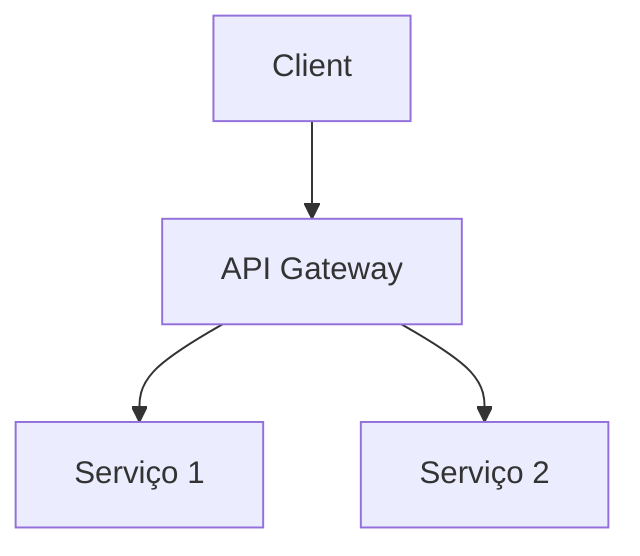

**Status do Projeto:**   
**Tipo de Projeto:** (Ex: Web App, Jogo Mobile, API, etc.)  
**Área Principal:** (Ex: Frontend, Backend, DevOps)

## 📋 Visão Geral
Breve descrição (2-3 parágrafos) explicando:
- Objetivo principal do projeto
- Problema que resolve
- Público-alvo
- Destaque único/diferencial

## 🛠️ Tecnologias Utilizadas
**Stack Principal:** 

**Frontend:**  
- React, Vue, etc.

**Backend:**  
- Node.js, Django, etc.

**Banco de Dados:**  
- PostgreSQL, MongoDB, etc.

**Outras Ferramentas:**  
- Docker, AWS, Figma, Unity

## ✨ Funcionalidades Principais
- Lista de features com emojis descritivos
- Ex para jogos: "Sistema de combate em tempo real ⚔️"
- Ex para backend: "API REST com autenticação JWT 🔐"

## 🎮 Demonstração (Opcional para jogos/UI)
```bash
# Comandos para rodar o projeto (se aplicável)
npm install
npm start
```

### Capturas de Tela/Vídeo
  
[Vídeo Demo](https://youtube.com/embed/xyz)

## 🧩 Arquitetura (Relevante para Backend/DevOps)


## 📂 Estrutura do Projeto (Opcional)
```
project-root/
├── src/
│   ├── components/
│   └── utils/
├── tests/
└── README.md
```

## 🚀 Desafios e Soluções
- **Desafio Técnico:** Descrição do problema + solução implementada
- **Decisão de Design:** Por que escolheu X tecnologia?

## 📈 Próximos Passos (Roadmap)
- [ ] Feature 1
- [x] Feature 2 (concluída)
- [ ] Otimização de performance

## 🔗 Links Úteis
- [Demo ao Vivo](https://)
- [Repositório](https://github.com/seusuario/projeto)
- [Documentação Técnica](https://)
- [Board de Tarefas](https://trello.com/b/xyz)

## 🤝 Contribuição
```bash
# Como contribuir (se for open source)
git clone https://github.com/seuusuário/projeto.git
npm install
```