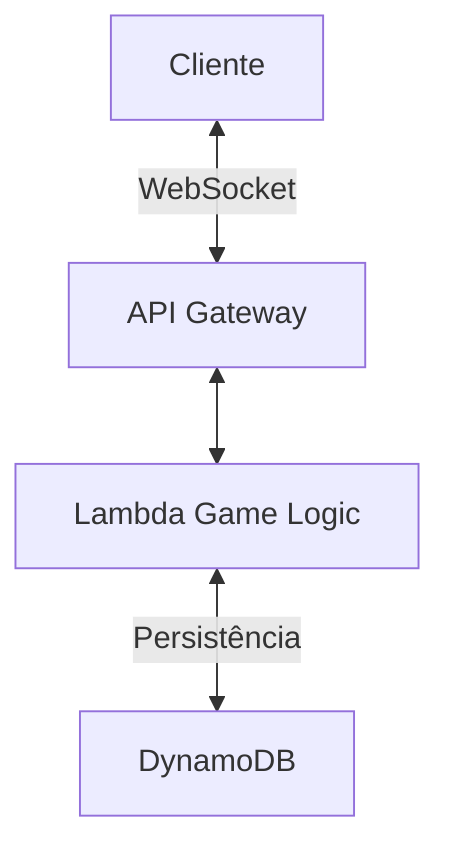

**Status do Projeto:**   
**Tipo de Projeto:** Jogo Multiplayer Web  
**Área Principal:** Frontend e Backend

## 📋 Visão Geral
O WordChain é um jogo multiplayer em tempo real no qual os jogadores formam cadeias de palavras de maneira competitiva. A cada rodada, os participantes devem inserir uma nova palavra onde o final da ultima palavra deve se encaixar no começo da palavra atual inserida. 

- **Objetivo principal**: Criar uma experiência divertida baseada em palavras.
- **Público-alvo**: Jogadores casuais e entusiastas de jogos de palavras.
- **Destaque único**: Trás uma mecânica simples pra o contexto multiplayer em tempo real.

## 🛠️ Tecnologias Utilizadas
**Frontend:**  
- React + Vite  
- RxJS para gerenciamento de eventos  

**Backend:**  
- AWS Lambda + API Gateway  
- Python (boto3 para integração com AWS)  

**Banco de Dados:**  
- DynamoDB  

**Outras Ferramentas:**  
- WebSockets  

## ✨ Funcionalidades Principais
- 🎮 **Modo Multiplayer em Tempo Real** usando WebSockets.
- 🔠 **Gerenciamento de Palavras** baseado em regras de pontuação.
- 👥 **Suporte a múltiplos jogadores** com sessões de jogo individuais.
- 🔄 **Reconexão Automática** para jogadores que perdem a conexão.
- 🔐 **Autenticação JWT (planejado)**.

## 🎮 Demonstração
```bash
# Para rodar o frontend
npm install
npm run dev

# Para rodar o backend
python lambda/main.py
```

### Capturas de Tela
Em breve...

## 🧩 Arquitetura


## 📂 Estrutura do Projeto
```tree
wordchain/
├── frontend/ (React + Vite)
│   ├── src/
│   ├── shared/
│   ├── components/
│   ├── hooks/
│   └── providers/
├── backend/ (Python + AWS Lambda)
│   ├── lambda/
│   ├── entities/
│   ├── interfaces/
│   ├── repository/
│   ├── utils/
│   └── main.py
└── README.md
```

## 🚀 Desafios e Soluções
- **Desafio Técnico:** Implementação de WebSockets com escalabilidade e com baixo custo.
  - **Solução:** Uso do API Gateway da AWS para gerenciar conexões juntamente com AWS Lambda.
- **Decisão de Design:** Escolha do DynamoDB para armazenar sessões e jogadores.
  - **Justificativa:** Baixa latência e integração direta com AWS Lambda.

## 📈 Próximos Passos
- [x] Implementação inicial do backend 🎯
- [x] Implementação inicial do frontend 🎨
- [ ] Adicionar efeitos sonoros 🔊
- [ ] Melhorar UI/UX para mobile 📱
- [ ] Adicionar sistema de pontuação mais robusto 🏆


## 🔗 Links Úteis
- [Repositório GitHub (frontend)](https://github.com/joismar/word-chain-client)
- [Documentação Técnica (backend)](https://github.com/joismar/word-chain-backend)